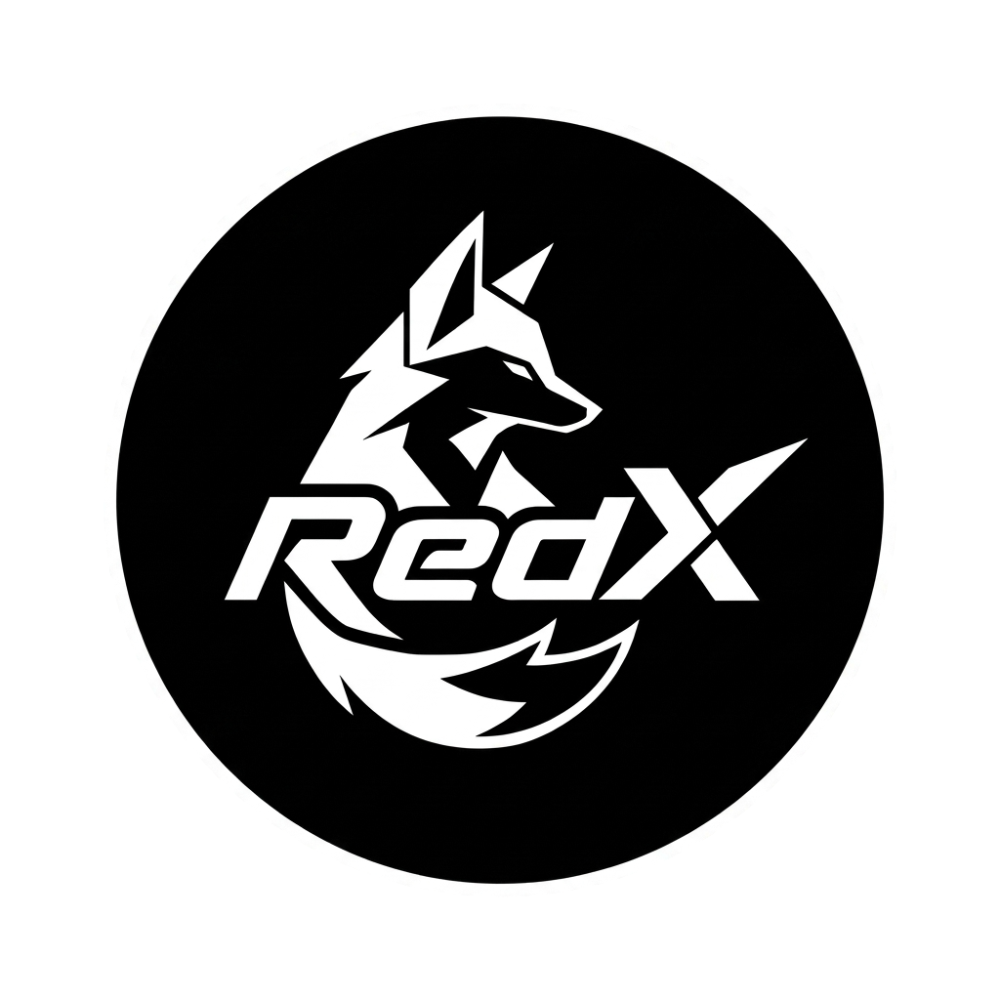
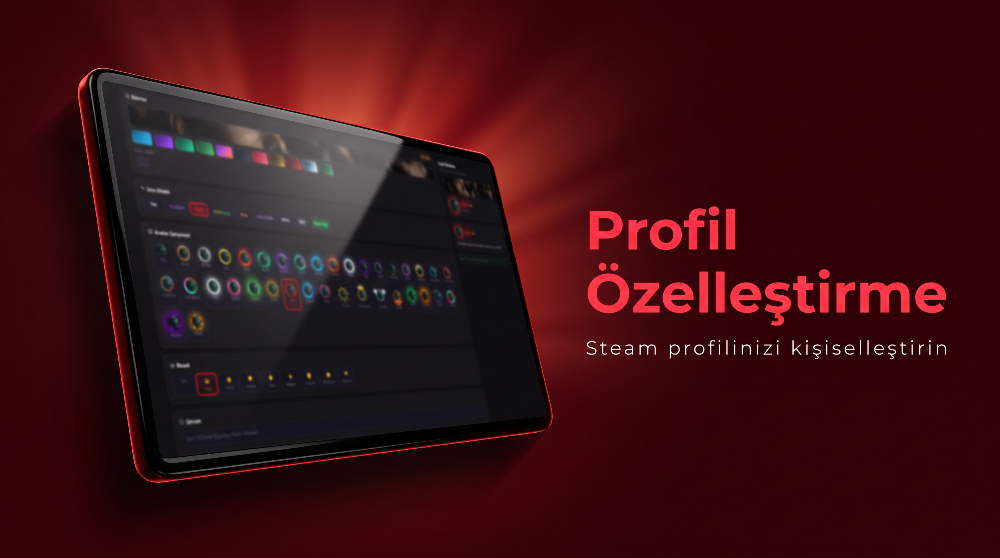

<div align="center">



# RedX Game Library

<p>
  
  
  
</p>
<p>
  
  
  
</p>
<p>
  <a href="https://discord.gg/FXhFrV3rqe"></a>
  <a href="https://youtube.com/@dokuman_tv"></a>
  <a href="https://github.com/furylemons/RedXGameLibrary"></a>
</p>

<br/>

**Sınırsız erişim, Bypass ve Online-Fix desteği sunan hepsi bir arada oyun kütüphanesi.**

**An all-in-one game library with full bypass, Online-Fix integration, and free game access.**

<br/>

[🇹🇷 Türkçe](#-türkçe) &nbsp;·&nbsp; [🇬🇧 English](#-english)

</div>

---

<br/>

## 🇹🇷 Türkçe

### RedX Nedir?

RedX Game Library, Steam ile derin entegrasyon sunan; kendi topluluk sistemi, premium üyelik kademeleri ve kapsamlı arayüz özelleştirmeleriyle öne çıkan bir Windows masaüstü uygulamasıdır.

> Uygulama henüz yayınlanmamıştır. Duyuru için Discord sunucumuzu ve GitHub sayfamızı takip edin.

---

### Ekran Görüntüleri

> Görseller geliştirme sürecinde çekilmiştir; son sürümde arayüz farklılık gösterebilir.

| Mağaza | Kütüphane | Topluluk |
|:---:|:---:|:---:|
|  |  |  |
| **Profil** | **Online Fix** | **İndirmeler** |
|  |  |  |
| **Bypass** | | |
|  | | |

---

### Özellikler

<details>
<summary><b>Mağaza (Store)</b></summary>
<br/>

- Trend, öne çıkan ve yeni çıkan oyunları keşfedin
- Tam metin arama, sayfalama, gelişmiş filtreleme
- Steam mağazasına tek tıkla erişim; sepet sistemi

</details>

<details>
<summary><b>Kütüphane (Library)</b></summary>
<br/>

- Steam kütüphanenizi RedX üzerinden yönetin
- Oyun başlatma, durdurma ve oynama süresi takibi
- DLC yönetimi, başarımlar, liste/ızgara modu, favoriler, notlar

</details>

<details>
<summary><b>Online Fix / Bypass / AltFix</b></summary>
<br/>

- Oyunlar için Online Fix yamalarını yönetin
- Steam olmadan oyun başlatmak için Bypass desteği
- AltFix: Microsoft Detours tabanlı DLL enjeksiyon sistemi

</details>

<details>
<summary><b>İndirmeler & Topluluk</b></summary>
<br/>

- Steam indirme kuyruğu ve tamamlanan indirmeleri takip edin
- Forum tarzı gönderi akışı; Tartışma, Rehber, Soru, Haber kategorileri
- Yorum, beğeni, paylaşım; XP ve seviye sistemi

</details>

<details>
<summary><b>Profil & XP Sistemi</b></summary>
<br/>

- Biyografi, avatar rengi veya özel fotoğraf
- XP kazanma, seviye atlama, başarım rozetleri, profil çerçeveleri
- Animasyonlu banner, renkli kullanıcı adı efektleri (Premium)
- Bağlı hesaplar: Discord, YouTube, GitHub, Steam

</details>

<details>
<summary><b>Premium Üyelik</b></summary>
<br/>

| Özellik | Ücretsiz | Bronze | Silver | Gold |
|---|:---:|:---:|:---:|:---:|
| Sepet limiti | 10 | 20 | 50 | Sınırsız |
| Günlük kütüphane ekleme | 20 | 50 | 100 | Sınırsız |
| Aylık oyun isteği | 3 | 10 | 25 | Sınırsız |
| Özel tema renkleri | — | — | Evet | Evet |
| Animasyonlu banner | — | — | — | Evet |
| Erken erişim | — | — | Evet | Evet |
| Öncelikli destek | — | Evet | Evet | Evet |
| Profil çerçevesi | — | Bronze | Silver | Gold |

</details>

<details>
<summary><b>Steam Arkadaşları / Oyun İsteği / Sorun Giderme</b></summary>
<br/>

- Steam arkadaş listesini gerçek zamanlı görüntüleyin
- Çevrimiçi, oyunda, uzakta, çevrimdışı durum göstergeleri
- Kütüphaneye oyun talep edin; yerleşik tanılama araçları

</details>
---

### Erişim & Doğrulama

| Yöntem | Açıklama | Bağlantı |
|---|---|:---:|
| Discord Rolü | Sunucumuza katılın, gerekli rolü alın | [discord.gg/FXhFrV3rqe](https://discord.gg/FXhFrV3rqe) |
| YouTube + GitHub | Kanala abone olun, repoya yıldız verin | [YouTube](https://youtube.com/@dokuman_tv) · [GitHub](https://github.com/furylemons/RedXGameLibrary) |
| Lisans Key | Satın aldığınız anahtarı girin | `REDX-XXXX-XXXX-XXXX-0000` |

---

### Arayüz & Özelleştirme

**Temalar:** Koyu (Dark) ve Açık (Light) mod

**Renk Paletleri:**

| Ücretsiz | Silver+ | Gold+ |
|---|---|---|
| Kırmızı & Siyah | Neon Yeşil | Altın & Siyah |
| Mor & Siyah | Cyan & Gece | Platin |
| Kobalt Mavi | Magenta | Nebula Mor |
| Zümrüt Yeşil | Lav Kırmızısı | Neon Pembe |
| Gün Batımı Turuncusu | Derin Uzay | Elmas Mavi |
| Okyanus Teal | Güneş Patlaması | Obsidyen & Altın |

**Pencere Stili:** macOS · Windows · Minimal · Neon · Retro · Cam · Terminal · Hap · Cyberpunk · Balon · Aurora · Elmas · Neon Çerçeve · Buzlu Cam · Samurai · Hologram

**Dil:** Türkçe ve İngilizce

---

### Lisans

```
Custom Proprietary License
Copyright (c) 2025-2026 RedX

Bu yazılımın kaynak kodu, ikili dosyaları veya herhangi bir bileşeni
yazılı izin alınmadan kopyalanamaz, dağıtılamaz veya değiştirilemez.
Tüm haklar saklıdır.
```

---

<br/>
## 🇬🇧 English

### What is RedX?

RedX Game Library is a Windows desktop application offering deep Steam integration, its own community system, premium membership tiers, and extensive interface customization.

> The application has not been released yet. Follow our Discord server and GitHub page for announcements.

---

### Screenshots

> All visuals are taken during development; the final interface may differ from what is shown.

| Store | Library | Community |
|:---:|:---:|:---:|
|  |  |  |
| **Profile** | **Online Fix** | **Downloads** |
|  |  |  |
| **Bypass** | | |
|  | | |

---

### Features

<details>
<summary><b>Store</b></summary>
<br/>

- Browse trending, featured, and new releases
- Full-text search, pagination, advanced filtering
- One-click Steam store access; cart system

</details>

<details>
<summary><b>Library</b></summary>
<br/>

- Manage your Steam library through RedX
- Launch, stop, and track playtime for any game
- DLC management, achievements, list/grid view, favorites, notes

</details>

<details>
<summary><b>Online Fix / Bypass / AltFix</b></summary>
<br/>

- Manage Online Fix patches for your library games
- Bypass support for launching games without Steam
- AltFix: DLL injection system powered by Microsoft Detours

</details>

<details>
<summary><b>Downloads & Community</b></summary>
<br/>

- Track Steam download queue and completed downloads
- Forum-style post feed; Discussion, Guide, Question, News categories
- Comments, likes, sharing; XP and level system

</details>

<details>
<summary><b>Profile & XP System</b></summary>
<br/>

- Bio, avatar color or custom photo
- XP earning, level progression, achievement badges, profile frames
- Animated banners, colored username effects (Premium)
- Linked accounts: Discord, YouTube, GitHub, Steam

</details>

<details>
<summary><b>Premium Membership</b></summary>
<br/>

| Feature | Free | Bronze | Silver | Gold |
|---|:---:|:---:|:---:|:---:|
| Cart limit | 10 | 20 | 50 | Unlimited |
| Daily library additions | 20 | 50 | 100 | Unlimited |
| Monthly game requests | 3 | 10 | 25 | Unlimited |
| Exclusive theme colors | — | — | Yes | Yes |
| Animated banner | — | — | — | Yes |
| Early access | — | — | Yes | Yes |
| Priority support | — | Yes | Yes | Yes |
| Profile frame | — | Bronze | Silver | Gold |

</details>

<details>
<summary><b>Steam Friends / Game Request / Troubleshoot</b></summary>
<br/>

- View your Steam friends list in real time
- Online, in-game, away, and offline status indicators
- Request games for the library; built-in diagnostic tools

</details>

---

### Access & Verification

| Method | Description | Link |
|---|---|:---:|
| Discord Role | Join our server and obtain the required role | [discord.gg/FXhFrV3rqe](https://discord.gg/FXhFrV3rqe) |
| YouTube + GitHub | Subscribe to the channel, star the repo | [YouTube](https://youtube.com/@dokuman_tv) · [GitHub](https://github.com/furylemons/RedXGameLibrary) |
| License Key | Enter your purchased key | `REDX-XXXX-XXXX-XXXX-0000` |

---

### Interface & Customization

**Themes:** Dark and Light mode

**Color Palettes:**

| Free | Silver+ | Gold+ |
|---|---|---|
| Red & Black | Neon Green | Gold & Black |
| Purple & Black | Cyan & Night | Platinum |
| Cobalt Blue | Magenta | Nebula Purple |
| Emerald Green | Lava Red | Neon Pink |
| Sunset Orange | Deep Space | Diamond Blue |
| Ocean Teal | Solar Flare | Obsidian & Gold |

**Window Styles:** macOS · Windows · Minimal · Neon · Retro · Glass · Terminal · Pill · Cyberpunk · Bubble · Aurora · Diamond · Neon Outline · Frosted Glass · Samurai · Hologram

**Languages:** Turkish and English

---

### License

```
Custom Proprietary License
Copyright (c) 2025-2026 RedX

The source code, binaries, or any component of this software may not
be copied, distributed, modified, or sublicensed without prior written
permission. All rights reserved.
```

---

<br/>

<div align="center">

Made with dedication by **furylemons** &nbsp;·&nbsp; **RedX Team**

<br/>

<a href="https://discord.gg/FXhFrV3rqe"></a>
&nbsp;
<a href="https://youtube.com/@dokuman_tv"></a>
&nbsp;
<a href="https://github.com/furylemons/RedXGameLibrary"></a>

<br/><br/>

<sub>Copyright (c) 2025-2026 RedX &nbsp;·&nbsp; All rights reserved.</sub>

</div>
